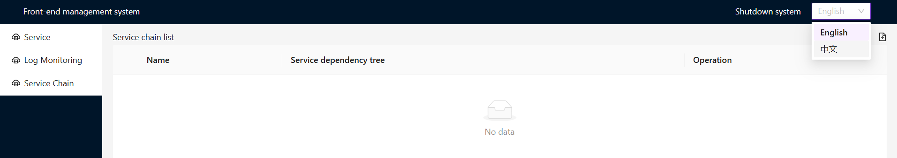

# automatic-i18n

## Introduction

automatic-i18n is an internationalization tool that automatically replaces language text in the source code(typescript、js、react) with one command and without writing additional code and generates multi-language files.

I hope that websites in different languages ​​can benefit more people in the world, hope world peace.

features:

- Write your code as if it were not an international project. Then run a one-line command which will replace all locale text with i18n keys and generate some message files according to your configuration. No need to write extra code.
- The languages ​​to be replaced and the languages ​​to be generated can be configured.
- Automatically merge template strings and jsx html text with variables.
- Integrated with `react-intl` library. (you could write your own custom render class by implement `I18nFormatter` and pass your class as params. Normally,The default class is enough)
- Supports hook mode (changing language in real time) and global mode, and can use custom render classes to determine how to replace source code and generate language files.
- Test coverage 98%.

## Example

Your code Before:

    import React from 'react';

    function Component() {
        const en = 'English';
        const cn = 'Chinese';
        const locales = `${en} and ${cn}`;

        return (
            

                Please choose your locale from: {en} {cn}
            

        );
    }

Your code will be replaced with the below after run command:

    import { useIntl, FormattedMessage } from 'react-intl';
    import React from 'react';

    function Component() {
        const intl = useIntl();

        const en = intl.formatMessage({
            id: 'key0001',
            defaultMessage: 'English',
        });
        const cn = intl.formatMessage({
            id: 'key0002',
            defaultMessage: 'Chinese',
        });
        const locales = intl.formatMessage({
            id: 'key0003',
            defaultMessage: '{v1} and {v2}',
            values: { v1: en, v2: cn },
        });

        return (
            

                <FormattedMessage
                    id="key0004"
                    defaultMessage="Please choose your locale from: {v1} {v2}"
                    values={{ v1: en, v2: cn }}
                />
            

        );
    }

Some locale message files will be generated automatic.

    /*
    * This file is automatic generated by automatic-i18n.
    * You can only change variable's value.
    */
    import { LocalKey } from './types';

    const locale: Record<LocalKey, string> = {
        key0001: 'English',
        key0002: 'Chinese',
        key0003: '{v1} and {v2}',
        key0004: 'Please choose your locale from: {v1} {v2}',
    };

    export default locale;

And the entry template file will be generated which will use above locale message files. This template export a provider and a global object and you could use them in your own prefer.
You could get my other project as example here: https://github.com/zcs19871221/local-development-console

enter the /web directory, make sure you have installed `Node.js 14` and relevant npm, execute `npm ci` then run `npm run dev`, then you could visit `http://localhost:5173/process` to see the effect:

# Quick start

## cli

`npx automatic-i18n`
you can get specific info with `npx automatic-i18n -h`

## api

The input parameter defined with `ReplacerOpt` below, only one parameter **I18nFormatter** is not exist in cli options.

    const I18nReplacer = require('automatic-i18n').default;

    I18nReplacer.createI18nReplacer({
        targets: ['components', 'hooks', 'middleware', 'modules', 'pages', 'utils'],
        uniqIntlKey: true,
    }).replace();

    export interface ReplacerOpt {
        // directories or files to extract locales
        targets?: string[];
        // folder where message files are generated
        distLocaleDir?: string;
        // locale to search in source code
        localeToReplace?: LocaleTypes;
        // which locales will be generated
        localesToGenerate?: LocaleTypes[];
        // if prefer global intl obj instead hook
        global?: boolean;
        // if true, will replace the message key with camel cased english translation
        meaningKey?: boolean;
        // if true, the message key will be generated from the message text, use hash
        uniqIntlKey?: boolean;
        // the class to define how to render the i18n message
        I18nFormatter?: I18nFormatterCtr;
        // a function list to determine whether to replace the file or dir
        filters?: Filter[];
        // a string list to exclude the file or dir if matched
        excludes?: string[];
        // if output debug information
        debug?: boolean;
        // if output to new dir instead of replace the original files
        outputToNewDir?: string;
    }

## configuration comments

### turn off next line

`/** auto-i18n-ignore-next ** /`

        /** auto-i18n-ignore-next ** /
        const name = 'chengsiZhang';

### turn off a block of code

`/** auto-i18n-ignore-start ** /`
`/** auto-i18n-ignore-end ** /`

        /** auto-i18n-ignore-start ** /
        const name = 'chengsiZhang';
        /** auto-i18n-ignore-end ** /

## for people who write english text("localeToReplace" param is 'en-us')

program will not collect english literal text unless you wrap codes with following comments.
`/** auto-i18n-collect-start ** /`
`/** auto-i18n-collect-end ** /`
`/** auto-i18n-collect-next ** /`

Because program can not distinguish if a english variable is a locale or a meaningful things(maybe the keyname of json data).Because non english language have a range of unicode and they will not be used as a meaningful thing.So if you set params "localeToReplace" as 'en-us', you have to use the above configuration comments to tell program which english literal variable need to be replace otherwise they will not be replaced. Only effect the literal string variable, the html and template string will not effect.see the below codes, the "welcome" is replaced, and the "user" is not.

    //before:
    function Component(fetchedData: any) {
        /* auto-i18n-collect-next */
        const title = 'welcome';
        const key = 'user';

        return <Header title={title}>Nice to meet you: {fetchedData[key]}</Header>;
    }

    //after:
    function Component(fetchedData: any) {
        /* auto-i18n-collect-next */
        const title = i18n.intl.formatMessage({
            id: 'key1fa62a482__',
            defaultMessage: 'welcome',
        });
        const key = 'user';

        return (
            <Header title={title}>
            {i18n.intl.formatMessage(
                {
                id: 'key1585b57b2__',
                defaultMessage: 'Nice to meet you: {v1}',
                },
                { v1: fetchedData[key] }
            )}
            </Header>
        );
    }

## License

The MIT License.
