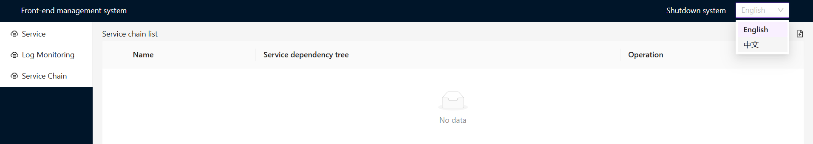

# automatic-i18n

[](https://github.com/zcs19871221/automatic-i18n/actions/workflows/npm-publish.yml)
[](https://coveralls.io/github/zcs19871221/automatic-i18n)
[](https://www.npmjs.com/package/automatic-i18n)

[English](./README.MD) | [简体中文](./README.zh-CN.md)

一条命令完成 TypeScript、JavaScript、React 项目中的文案提取与 i18n 替换。

automatic-i18n 会扫描源码、基于 AST 解析文本节点、将命中文案替换为 i18n 调用，并自动生成多语言文件。

## 为什么用 automatic-i18n

- 不需要先做大规模手工改造再接入国际化。
- 支持 JSX 文本、字符串字面量、带变量的模板字符串。
- 默认集成 react-intl。
- 同时支持 Hook 模式与全局对象模式。
- 可通过实现 I18nFormatter 自定义替换与产物格式。
- 提供 locale 冲突合并命令，处理 git conflict 更省心。

## 60 秒快速开始

1. 在你的项目中安装依赖：

```bash
npm i -D automatic-i18n typescript prettier fs-extra
```

2. 执行替换：

```bash
npx automatic-i18n -t src
```

3. 在默认目录 ./i18n 查看生成的语言文件。

查看帮助：

```bash
npx automatic-i18n -h
```

## CLI

安装后可通过 npx automatic-i18n（或 npx i18n）使用命令行。

### 常用命令示例

提取 src 中的中文，并生成 zh-cn 与 en-us 两份语言文件：

```bash
npx automatic-i18n -t src -sl zh-cn -tl zh-cn en-us
```

使用全局 intl 对象模式（而不是 Hook 模式）：

```bash
npx automatic-i18n -t src -g
```

排除特定目录：

```bash
npx automatic-i18n -t src -e dist build
```

使用基于文本内容的唯一 key：

```bash
npx automatic-i18n -t src -u
```

合并包含 git 冲突标记的 locale 文件：

```bash
npx automatic-i18n merge ./i18n ./i18n
```

### CLI 参数

- -t, --targets <fileOrDir...>: 需要处理的文件或目录。默认：当前工作目录。
- -d, --distLocaleDir <fileOrDir>: 语言文件输出目录。默认：<cwd>/i18n。
- -sl, --localeToReplace <locale>: 需要在源码中匹配的语言。可选：en-us、zh-cn。默认：zh-cn。
- -tl, --localesToGenerate <locales...>: 需要生成的语言。默认：zh-cn en-us。
- -g, --global: 使用全局 intl 对象模式。
- -e, --excludes <filesOrDirs...>: 按名称排除文件或目录。
- -m, --meaningKey: 尝试将自动 key 转为语义化英文 key。
- -u, --uniqIntlKey: 基于 message 哈希生成 key，降低 key 冲突概率。
- -db, --debug: 输出调试日志。
- -v, --version: 输出版本号。

## 替换前后示例

替换前：

```tsx
import React from 'react';

function Component() {
  const en = 'English';
  const cn = 'Chinese';
  const locales = `${en} and ${cn}`;

  return (
    <div>
      Please choose your locale from: {en} {cn}
    </div>
  );
}
```

替换后：

```tsx
import { useIntl, FormattedMessage } from 'react-intl';
import React from 'react';

function Component() {
  const intl = useIntl();

  const en = intl.formatMessage({
    id: 'key0001',
    defaultMessage: 'English',
  });
  const cn = intl.formatMessage({
    id: 'key0002',
    defaultMessage: 'Chinese',
  });
  const locales = intl.formatMessage({
    id: 'key0003',
    defaultMessage: '{v1} and {v2}',
    values: { v1: en, v2: cn },
  });

  return (
    <div>
      <FormattedMessage
        id="key0004"
        defaultMessage="Please choose your locale from: {v1} {v2}"
        values={{ v1: en, v2: cn }}
      />
    </div>
  );
}
```

生成的语言文件示例：

```ts
/*
 * This file is automatically generated by automatic-i18n.
 * You should only change locale values.
 */
import { LocalKey } from './types';

const locale: Record<LocalKey, string> = {
  key0001: 'English',
  key0002: 'Chinese',
  key0003: '{v1} and {v2}',
  key0004: 'Please choose your locale from: {v1} {v2}',
};

export default locale;
```

演示项目：

https://github.com/zcs19871221/local-development-console

预览图：



## API

```js
const I18nReplacer = require('automatic-i18n').default;

I18nReplacer.createI18nReplacer({
  targets: ['src'],
  uniqIntlKey: true,
}).replace();
```

```ts
export interface ReplacerOpt {
  targets?: string[];
  distLocaleDir?: string;
  localeToReplace?: 'en-us' | 'zh-cn';
  localesToGenerate?: Array<'en-us' | 'zh-cn'>;
  global?: boolean;
  meaningKey?: boolean;
  uniqIntlKey?: boolean;
  I18nFormatter?: I18nFormatterCtr;
  filters?: Filter[];
  excludes?: string[];
  debug?: boolean;
  outputToNewDir?: string;
  addMissingDefaultMessage?: boolean;
}
```

额外导出：

- resolveMergeConflict(distDir, outputDir)

## 安全使用建议

对于大仓库，建议采用渐进式接入：

1. 先提交当前代码，确保可回滚。
2. 做 diff 对比并跑测试。
3. 审核通过后再合并到主分支。

## 注释控制规则

### 忽略下一行

```ts
/* auto-i18n-ignore-next */
const name = 'chengsiZhang';
```

### 忽略代码块

```ts
/* auto-i18n-ignore-start */
const name = 'chengsiZhang';
/* auto-i18n-ignore-end */
```

### 英文模式（localeToReplace: 'en-us'）

在英文模式下，字符串字面量默认不会被收集，必须显式标注。

可用注释：

- /_ auto-i18n-collect-start _/
- /_ auto-i18n-collect-end _/
- /_ auto-i18n-collect-next _/

示例：

```tsx
// before
function Component(fetchedData: any) {
  /* auto-i18n-collect-next */
  const title = 'welcome';
  const key = 'user';

  return <Header title={title}>Nice to meet you: {fetchedData[key]}</Header>;
}

// after
function Component(fetchedData: any) {
  /* auto-i18n-collect-next */
  const title = i18n.intl.formatMessage({
    id: 'key1fa62a482__',
    defaultMessage: 'welcome',
  });
  const key = 'user';

  return (
    <Header title={title}>
      {i18n.intl.formatMessage(
        {
          id: 'key1585b57b2__',
          defaultMessage: 'Nice to meet you: {v1}',
        },
        { v1: fetchedData[key] }
      )}
    </Header>
  );
}
```

## 已知边界

- 当前主要面向 TypeScript/JavaScript/JSX/TSX 代码解析。
- 英文模式下，字符串字面量需要配合 collect 注释。
- 合并到生产分支前，建议总是人工审核 diff。

## License

MIT
